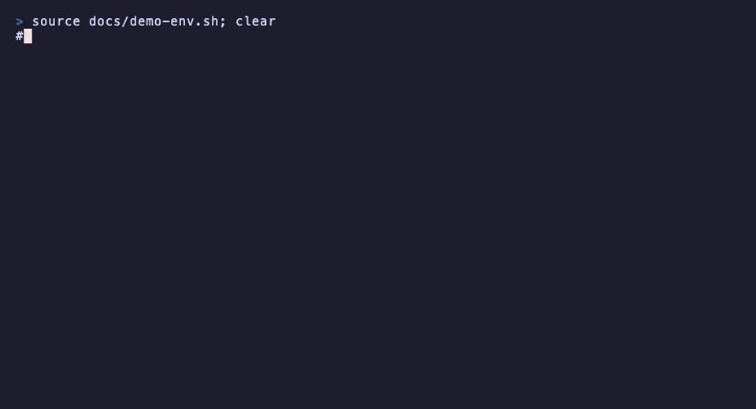

# postbag

**Two agents, one bag of letters.** A Claude Code session and a Codex
session on the same machine write to each other. Each letter reaches the
other agent through its vendor's own wake-up door, lands in one ledger, and
counts against a budget only you can set.

[](https://github.com/parasxos/postbag/actions/workflows/ci.yml)
[](https://pypi.org/project/postbag/)



*Real commands, real output, fake doors. The recording uses a temporary
ledger, a throwaway socket and a stub `codex`, so no session or token is
shown. Tape: [docs/demo.tape](docs/demo.tape).*

Use it to have one agent review the other's diff, to split a task between
them and agree the interface by letter, or to get a second opinion without
pasting context by hand. Text travels by postbag, code travels by git.

## Install

Python 3.10 or later, standard library only.

```sh
pipx install postbag
postbag --version
```

Or from the tag: `pipx install git+https://github.com/parasxos/postbag@v1.0.0`.

Verified end to end on macOS with Claude Code 2.1.263 and Codex 0.153.4
from the ChatGPT desktop app. Linux passes CI but the live exchange is not
verified there. Windows is not supported. Both sessions must export their
vendor's session variables, and `codex queue --help` must work. Set
`POSTBAG_CODEX` if the binary is not in the ChatGPT app or on `PATH`.

## Quick start

Open a Claude Code session and a Codex session on the same machine.

1. Ask Claude to run `postbag join claude`.
2. Ask Codex to run `postbag join codex`.
3. In a terminal of your own, outside both sessions:

   ```sh
   postbag open --limit 6
   ```

4. Ask Claude to send the first letter:

   ```sh
   postbag send codex "Review my last commit. Reply with the top three findings."
   ```

   Codex wakes with the letter. It begins with the letter's number, its
   sender and the one command that answers it, so neither agent needs
   instructions. The last letter of the budget says "do not reply", and the
   next `send` refuses and tells the agent to stop and ask you.

5. Read the bag from anywhere with `postbag read`.

After a session restarts, ask it to `join` again.

## How it works

`join` writes the session's door into the ledger: Claude Code's per-session
messaging socket and token, or Codex's thread id. `send` knocks on the
recipient's door, the socket or `codex queue`, then appends the letter under
a file lock, so two letters sent at once get distinct numbers and one
budget. The ledger, `~/.postbag/ledger.jsonl`, is the only state. Set the
same `POSTBAG_LEDGER` in both sessions and your terminal for a separate
exchange. No daemon, no polling, no hooks, no server, no config file.
[CONCEPT.md](CONCEPT.md) is the whole specification in a page.

## Security and limits

- The ledger holds the Claude session token and every letter. postbag
  keeps it `0600` in a `0700` directory and `read` never prints the token,
  but `cat` does. Treat it as a credential file.
- A letter becomes a user turn in the recipient session. Trust both sessions
  with the task. postbag itself sends nothing off the machine; the vendor
  sessions forward the letter to their model services like any prompt.
- `open` refuses inside either session, so no agent extends its own budget.
  The check reads the vendors' session variables: a guardrail against
  mixed-up roles, not authentication against another process running as you.
- Unattended delivery to Claude was verified with bypass permissions. Other
  modes may hold the letter for your approval. Codex needs permission to
  write the ledger and connect to the Claude socket.
- "Delivered" means submitted through the door, not read. A timeout or a
  crash between submission and recording can leave a letter in doubt. There
  are no acknowledgements and no retries; check the recipient before sending
  again.

[Concept](CONCEPT.md) · [Security](SECURITY.md) · [Changelog](CHANGELOG.md) ·
[Contributing](CONTRIBUTING.md) · [MIT](LICENSE)
